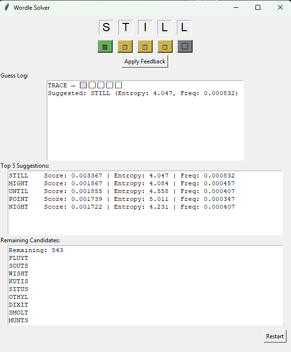

# 🧠  Wordle Solver v1.0.0

<p align="center">
    
</p>

A Python-based Wordle solver that uses entropy and word frequency to suggest optimal guesses. Includes both a GUI and CLI interface, with full hard mode enforcement.

**🎉 NEW: Windows executable files available! No Python installation required.**

---

## 📦 Features

- ✅ Modular architecture (GUI, CLI, logic, feedback, wordlist)
- ✅ Positional enforcement (green/yellow/gray constraints)
- ✅ Entropy × frequency scoring for smart suggestions
- ✅ Top 5 guess recommendations
- ✅ CLI support for terminal-based solving
- ✅ Unit tests for feedback and solver logic
- ✅ **Windows executable files for easy distribution**

---

## 🚀 Quick Start

### Option 1: Windows Executable (Recommended)
Download the latest release executable:
- **WordleSolver.exe** - GUI version with visual interface
- **WordleSolverCLI.exe** - Command-line version

No Python installation required! See [RELEASE.md](RELEASE.md) for download links and detailed instructions.

### Option 2: Run from Source
```bash
git clone https://github.com/BrianJackson/Wordle.git
cd Wordle
pip install -r requirements.txt
python main.py  # For GUI
# or
python cli.py --guess crane --feedback BYGBY  # For CLI
```

---

## 🖥️ GUI Usage

🧠 Click the boxes to provide feedback on the current guess in the text box
The solver enforces logical consistency across guesses:
- 🟩 Green letters must stay in the same position
- 🟨 Yellow letters must be reused, but not in the same position
- ⬜ Gray letters must be excluded from future guesses (unless confirmed as green/yellow)
This ensures every guess builds on known information and avoids wasteful plays.

Run the GUI with:

```bash
python main.py
```
## 🧪 CLI Usage
Run the solver from the terminal:
```bash
python cli.py --guess crane --feedback BYGBY
```

🎯 CLI Feedback Format
Each letter in the feedback string corresponds to the result of your guess:
- B = Gray (letter not in the word)
- Y = Yellow (letter is in the word but wrong position)
- G = Green (letter is correct and in the correct position)

Example:
```bash
python cli.py --guess crane --feedback BYGBY
```
Means:
- C = not in the word
- R = in the word, wrong position
- A = correct position
- N = not in the word
- E = in the word, wrong position
The CLI will return:
- Number of remaining candidates
- Top 5 suggestions with entropy × frequency scores

🧪 Running Tests
Unit tests are located in the tests/ folder. Run all tests with:
python -m unittest discover tests


```bash
📁 Folder Structure
wordle/
├── main.py          # GUI entry point
├── cli.py           # Command-line interface
├── wordlist.py      # Word list and frequency scoring
├── feedback.py      # Feedback logic and hard mode
├── solver.py        # Entropy and filtering
├── wordle_list.txt  # Word list (5-letter words) from https://github.com/tabatkins/wordle-list/blob/main/words
├── __init__.py      # Package initializer
└── tests/
    ├── test_feedback.py
    └── test_solver.py
```


📌 Requirements

### For Executable Users
- Windows 10 or later
- No additional software needed!

### For Python Users
- Python 3.8+
- Dependencies: `pip install -r requirements.txt`
  - wordfreq
  - numpy  
  - pyinstaller (for building executables)

### For Developers
```bash
pip install -r requirements.txt
python -m unittest discover tests  # Run tests
python build_executable.py         # Build executables
```


🧠 Hard Mode Explained
Hard mode enforces logical consistency across guesses:
- 🟩 Green letters must stay in the same position
- 🟨 Yellow letters must be reused, but not in the same position
- ⬜ Gray letters must be excluded from future guesses (unless confirmed as green/yellow)
This ensures every guess builds on known information and avoids wasteful plays.

🚀 Future Ideas
- Toggle for hard mode on/off
- Export guess history
- Visual entropy distribution
- Solver API for integration

Happy solving!
